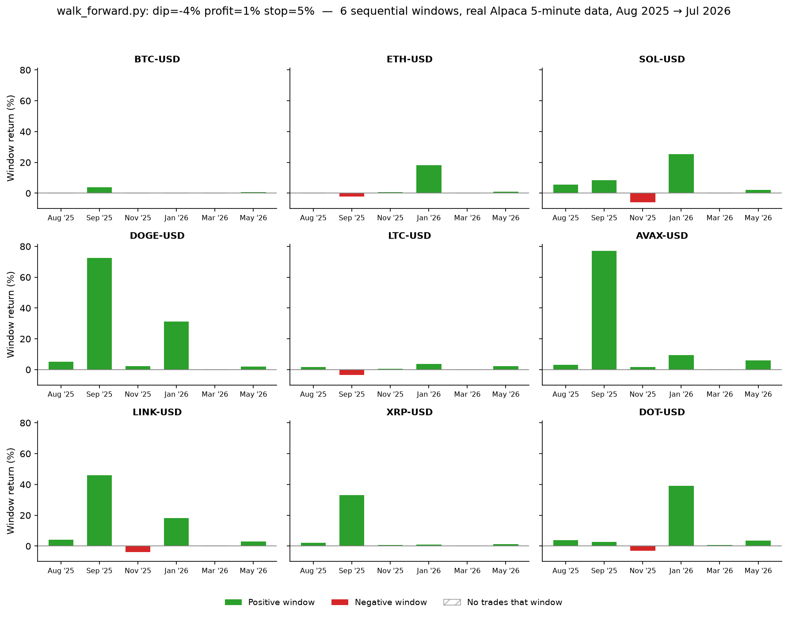
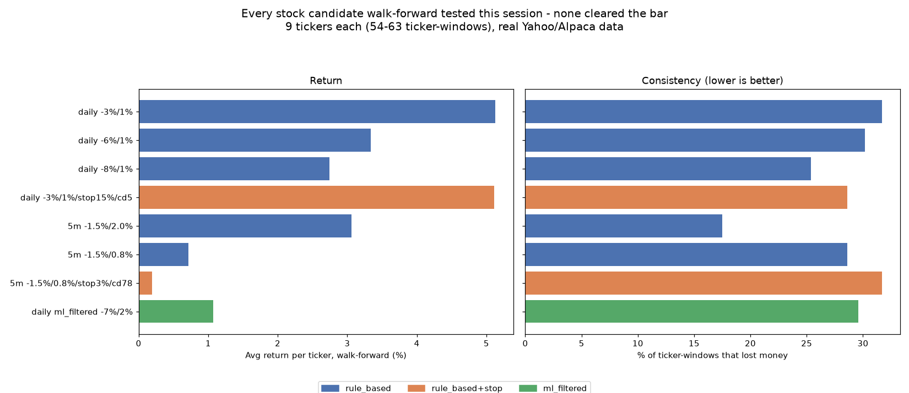
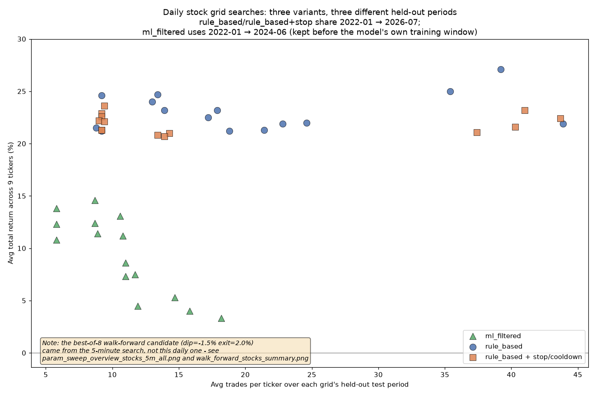
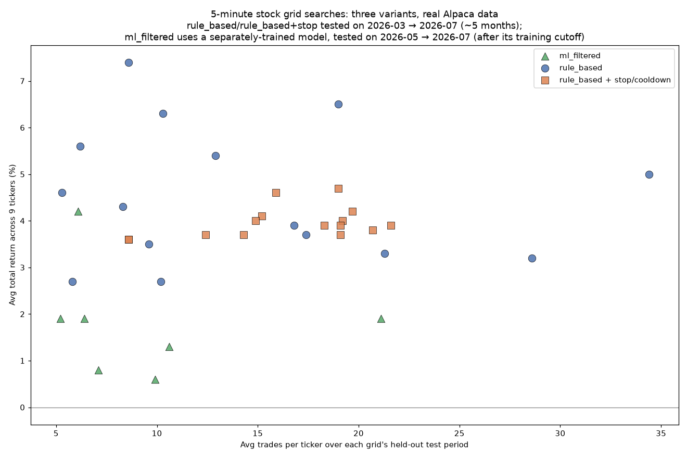

<div align="center">

# InvestingBot — Version Richards 0.9.2

[](https://www.python.org/downloads/)
[](tests/)
[](docs/RISK.md)
[](CHANGELOG.md)

*A systematic "buy the dip" strategy for stocks and crypto — backtested, searched, validated, and paper-traded in the open.*

</div>

Version history lives in `CHANGELOG.md`.

A "buy the dip" stock and crypto strategy: I backtest it, search for better
settings systematically, then optionally run it automatically against a
paper (fake-money) brokerage account.

> [!WARNING]
> **Not investment advice.** I built this to answer a specific question before
> any real money gets involved: do these dip-buying rules actually beat just
> buying and holding? For a long time the honest answer was no. As of
> 2026-07-27, walk-forward validation against a real year of data found a
> configuration that may have found something real - **meaningfully
> de-risked, not yet a proven steady edge** - which is exactly why it's
> running live on the paper account now instead of just sitting in a
> backtest. See "Current live status" below for the full picture, caveats
> included. I'm only going to consider real money once
> something actually demonstrates an edge with real trades, not just
> backtested ones.

## Contents

- [Documentation](#documentation)
- [Current live status](#current-live-status-as-of-this-writing)
- [Setup](#setup)
- [Architecture](#architecture)
- [Security: who can see what, and who can change what](#security-who-can-see-what-and-who-can-change-what)
- [Disclaimer](#disclaimer)

---

## Documentation

This README covers the overview, current status, installation, and
architecture. Deeper material lives in `docs/`:

- **[docs/BEGINNER_GUIDE.md](docs/BEGINNER_GUIDE.md)** - new to this
  project, or newer to coding in general? A plain-English walkthrough of
  every piece: what a workflow file is, what `--strategy day_trading`-style
  options mean, why this is all in Python, how the automation runs every
  5 minutes without a computer being on, plus a glossary of terms used
  throughout this repo.
- **[docs/AUTOMATION.md](docs/AUTOMATION.md)** - setting up automated
  paper trading: Alpaca account/keys, GitHub Actions, cron-job.org, crypto
  vs. stock specifics, and how logging/the trade dashboard work.
- **[docs/RISK.md](docs/RISK.md)** - the risk controls currently in
  place (circuit breaker, position cap), and what's required before this
  ever touches real money.
- **[docs/RESEARCH.md](docs/RESEARCH.md)** - backtesting, what each
  strategy and the ML model actually do, and the two tools for searching
  and validating parameter choices (`optimize.py`, `walk_forward.py`).
- **[CHANGELOG.md](CHANGELOG.md)** - full version-by-version history.

---

## Current live status (as of this writing)

I keep this section updated so I don't have to reverse engineer what's
actually running from workflow files six months from now.

| Component | Status |
|---|---|
| Crypto automation | Running (paper), every 5 min |
| Stock ML automation | **Paused** (2026-07-27 - see below) |
| Unit tests | 71 passing (`pytest tests/`) |
| Real-money mode | Disabled (2 independent locks - see `docs/RISK.md`) |
| Demonstrated edge | No |
| Closed live trades (current config) | 0 - archived 3 prior trades, see below |
| Max crypto purchase (`--max-notional`) | $2,000 |
| Daily loss circuit breaker (`--daily-loss-limit`) | 5% |

This is a snapshot and will be stale by the time you read it - check
`results/trade_dashboard.png` for the live number.

- **Crypto: rule-based, no ML. Thresholds changed 2026-07-27, backed by
  real validation evidence.** An external free scheduler
  ([cron-job.org](https://cron-job.org)) calls GitHub's API every 5
  minutes to run `.github/workflows/paper-trade-crypto.yml`, which runs
  `live_trade.py --strategy day_trading` against **BTC, ETH, SOL, DOGE,
  LTC, AVAX, LINK, XRP, DOT** on 5-minute bars: buy a **4.0%** dip, sell
  at **+1.0%** profit or **-5.0%** stop-loss (previously 1.0% / 1.0% /
  3.0%). The old combo bought on any 1%+ dip, which fires constantly on
  5-minute bars; a `walk_forward.py` run against a real year of Alpaca
  data found it losing money in 53 of 54 ticker/window tests, with
  100-1,000+ trades per ticker in a single ~2-month window - transaction
  costs alone likely explain a large share of that. The new -4%
  threshold only buys real, comparatively rare dips (4-52 trades per
  ticker over the same full year) and improved to 49 of 54 non-negative
  results. **Real evidence, committed and checkable:**
  [`results/param_sweep.csv`](results/param_sweep.csv) (the 90-combo
  grid search that found this combo) and
  [`results/walk_forward.csv`](results/walk_forward.csv) (its per-window
  validation). Read this as **meaningfully de-risked, not yet a proven
  steady edge** - a large share of the gain sits in two specific
  calendar windows where several coins moved together (more likely a
  broad market swing than nine independent edges), and a couple of the
  winning windows had large intra-window drawdowns (LTC -37.7%, LINK
  -31.8%) that their final positive return doesn't show. Now
  accumulating fresh real trade history under the new settings - see
  `CHANGELOG.md` 0.7.0 for the full writeup.

  

  

- **Stocks: paused as of 2026-07-27.** The account was carrying an
  unmanaged ~$33k QQQ position (about a third of its value) from an
  order that silently filled sometime after being submitted outside
  market hours - never logged, since `live_trade.py` only records a
  trade at the moment a run makes a fresh decision, not when an old
  pending order quietly clears later on its own. That discovery also
  surfaced a real gap: unlike crypto, the stock workflow never had
  `--max-notional` or `--daily-loss-limit` wired in at all - nothing was
  capping how large a single stock position could grow. The cron-job.org
  jobs driving `paper-trade-stocks.yml`/`retrain-stock-model.yml` are
  paused and the QQQ position was closed manually; see `CHANGELOG.md`
  0.8.0. `optimize.py`/`walk_forward.py` now both support `--strategy
  rule_based` (see `docs/RESEARCH.md`) so the stock strategy can
  actually be validated, the same way crypto's was, before stocks ever
  resume. The ticker list also grew from 3 to 9 while paused - SPY/QQQ
  (broad market), AAPL (tech), JPM (financials), XOM (energy), JNJ
  (healthcare), KO (staples), CAT (industrials), DIS (media) - spanning
  several sectors on purpose, the same "one ticker isn't a real edge"
  principle crypto's validation already leans on.
- **Stock validation: 8 candidates walk-forward tested, none cleared the
  bar.** Across an extensive search - daily and 5-minute bars, the plain
  `rule_based` rule, a version with a hard stop-loss and re-entry
  cooldown added, and `ml_filtered` (the same rule gated by a trained ML
  model) - every candidate's walk-forward loss rate landed in roughly
  the same 17-32% range, and no combination of return/consistency/trade
  count stood out as genuinely robust. This is an honest result, not a
  dead end: it means dip-buying these 9 stocks hasn't shown a real edge
  yet at either resolution, with or without an ML filter, the same
  place crypto's own validation started before `walk_forward.py` found
  something worth trusting. `get_stock_bars_range()`
  (`src/alpaca_data.py`) lets stocks pull intraday bars from Alpaca now,
  the same way crypto does; `rule_based_dip_buy()` gained an optional
  `stop_loss` + `stop_cooldown_bars` (a real walk-forward run found the
  stop-loss alone could backfire - SPY's 2019-2021 window went from
  -3.2% to -27.4% - fixed by adding the cooldown); `optimize.py`/
  `walk_forward.py`/`train_stock_model.py` all gained `--strategy
  ml_filtered` support. Every grid and walk-forward run is committed as
  real evidence in `results/` (see `docs/RESEARCH.md` for the full
  candidate-by-candidate breakdown and every command used).

  

  

  
- **Dashboard: five panels, regenerated hourly.** `results/trade_dashboard.png`
  is committed automatically, viewable directly on github.com: one
  whole-account net gain/loss panel, plus cumulative realized P&L and
  win/loss-per-ticker each split into separate crypto/stock panels
  rather than blended together - two very different strategies sharing
  one chart said less than two side by side do. A snapshot from before
  this split and before the pause above is archived at
  `results/trade_dashboard_archive_pre_2026-07-27.png`.
- **Current results snapshot:** the account is at **-$212.90** against
  its $100,000 funding baseline - includes the just-closed QQQ position's
  realized loss, on top of the +$292.84 the account was at from crypto
  trading before that close. `logs/trade_log.csv` was archived to
  `logs/trade_log_archive_pre_2026-07-27.csv` alongside the threshold
  change (its 3 old-model crypto trades: realized P&L **-$533.58** all
  together, or **+$365.37** excluding the one flagged bug-inflated
  trade) and started fresh, so it currently has zero rows - the new
  crypto config hasn't closed a trade yet. Full history of every bug and
  change that shaped these numbers is in `CHANGELOG.md`.

---

## Setup

Everything below takes you from a completely fresh machine (nothing
installed) to being able to run every command in this README. Pick
whichever section matches your operating system - both end up in the
exact same place.

**Prerequisites, either way:**
- Python 3.12 or newer
- git
- A free [Alpaca](https://alpaca.markets) account - only needed for
  live paper trading later on, not for the backtesting steps below

### Windows

1. **Install Python.** Download the installer from
   [python.org/downloads](https://www.python.org/downloads/). On the
   first install screen, check **"Add python.exe to PATH"** before
   clicking Install - easy to miss, and without it `python` won't be
   recognized in a terminal.
2. **Install git.** Download from
   [git-scm.com/download/win](https://git-scm.com/download/win) and run
   the installer, default options are fine.
3. **Open a terminal.** PowerShell works (search "PowerShell" in the
   Start menu).
4. **Clone the repository:**
   ```powershell
   git clone https://github.com/HarringtonEthan/InvestingBot.git
   cd InvestingBot
   ```
5. **Create and activate a virtual environment** - keeps this project's
   Python packages separate from anything else on your machine:
   ```powershell
   python -m venv venv
   venv\Scripts\activate
   ```
   The prompt should now start with `(venv)` - that confirms it worked.
6. **Install dependencies:**
   ```powershell
   pip install -r requirements.txt
   ```
7. **Verify it works:**
   ```powershell
   python main.py --ticker SPY --start 2015-01-01 --split 2022-01-01 --end 2024-12-31
   ```
   This should print a strategy comparison table and save a chart to
   `results/equity_curve.png`.

### macOS

1. **Install Python.** macOS ships with an old system Python that
   shouldn't be used for this - install a current version instead.
   Easiest path is [Homebrew](https://brew.sh):
   ```bash
   /bin/bash -c "$(curl -fsSL https://raw.githubusercontent.com/Homebrew/install/HEAD/install.sh)"
   brew install python@3.12
   ```
   Or download the installer directly from
   [python.org/downloads](https://www.python.org/downloads/).
2. **Install git.** Usually already present - check with
   `git --version` in Terminal. If it's missing, macOS will prompt to
   install the Xcode Command Line Tools, or install it via Homebrew:
   `brew install git`.
3. **Open Terminal** (Applications -> Utilities -> Terminal, or
   Spotlight search "Terminal").
4. **Clone the repository:**
   ```bash
   git clone https://github.com/HarringtonEthan/InvestingBot.git
   cd InvestingBot
   ```
5. **Create and activate a virtual environment:**
   ```bash
   python3 -m venv venv
   source venv/bin/activate
   ```
   The prompt should now start with `(venv)` - that confirms it worked.
6. **Install dependencies:**
   ```bash
   pip install -r requirements.txt
   ```
7. **Verify it works:**
   ```bash
   python main.py --ticker SPY --start 2015-01-01 --split 2022-01-01 --end 2024-12-31
   ```
   This should print a strategy comparison table and save a chart to
   `results/equity_curve.png`.

Once setup is done, see `docs/AUTOMATION.md` to connect a real (paper)
Alpaca account and run this on a schedule, or `docs/RESEARCH.md` to run
and interpret a backtest first.

---

## Architecture

```
InvestingBot/
├── .env.example                  # Template for local Alpaca credentials - copy to .env, never commit .env itself
├── requirements.txt              # Pinned third-party Python dependencies
├── main.py                       # Backtest entry point (research only, no real broker involved)
├── optimize.py                   # Multi-ticker parameter sweep for the day-trading strategy
├── walk_forward.py               # Validates a parameter combo across multiple time periods, not just one
├── train_stock_model.py          # Trains and saves the stock ML dip-filter model
├── live_trade.py                 # Automated live (paper) trading entry point
├── visualize_log.py              # Builds the trade dashboard PNG from the logs below
├── src/
│   ├── data.py                   # Price data loading (Yahoo Finance + synthetic fallback; Alpaca-first for crypto validation)
│   ├── alpaca_data.py            # Live crypto price data (Alpaca, used instead of Yahoo)
│   ├── features.py               # Technical indicators (SMA, RSI, volatility, drawdown)
│   ├── strategies.py             # The five trading strategies
│   ├── model.py                  # ML dip-filter: training and label logic
│   ├── model_store.py            # Save/load a trained model to disk
│   ├── backtest.py               # Backtest engine: turns a position series into results
│   ├── broker.py                 # Alpaca account/order wrapper
│   └── symbols.py                # Resolves a ticker into Yahoo/Alpaca symbol formats
├── .github/workflows/
│   ├── paper-trade-crypto.yml    # Runs live_trade.py for crypto every 5 minutes
│   ├── paper-trade-stocks.yml    # Runs live_trade.py for stocks daily near market close
│   ├── retrain-stock-model.yml   # Runs train_stock_model.py weekly
│   └── update-dashboard.yml      # Runs visualize_log.py hourly
├── tests/                        # pytest suite - run with `pytest tests/`
├── docs/                         # Beginner guide, automation setup, risk controls, research tools
├── logs/                         # Generated: trade_log.csv, equity_log.csv, retrain_log.csv
├── models/                       # Generated: the saved stock_model.pkl and its metadata
├── results/                      # Generated: equity_curve.png, trade_dashboard.png, param_sweep.csv, walk_forward.csv, and their chart renders
├── CHANGELOG.md                  # Full version history
└── README.md                     # This file
```

**Two separate pipelines share code:**
- **Backtesting (research, no real money, no live prices):**
  `main.py` / `optimize.py` / `walk_forward.py` → `src/data.py` (fetch
  *historical* data) → `src/features.py` (compute indicators like
  RSI/SMA) → `src/strategies.py` (simulate what a strategy *would have*
  done) → `src/backtest.py` (score it: return, Sharpe, drawdown). Nothing
  here ever touches a real broker.
- **Live trading (paper money, real live prices, right now):**
  `live_trade.py` → `src/alpaca_data.py` or `src/data.py` (fetch
  *current* data) → `src/features.py` (same indicator code) →
  `src/strategies.py` or `src/model.py` (make today's actual decision)
  → `src/broker.py` (place the real - paper - order via Alpaca) →
  `logs/*.csv` (record what happened).

Both pipelines reuse the same feature/strategy code on purpose - it's
the only way to trust that a backtest result says anything about what the
live version will actually do; if they used separate logic, a good
backtest wouldn't mean anything about live behavior.

See `docs/RESEARCH.md` for what each strategy and the ML model actually
do, and `docs/AUTOMATION.md` for the live-trading, logging, and dashboard
files.

---

## Security: who can see what, and who can change what

A public GitHub repository means the source code is visible to anyone -
every strategy, every threshold, every workflow file. That doesn't mean
credentials are exposed; a few separate mechanisms decide what actually
is and isn't visible or changeable:

- **API keys and secrets are never in the code, and aren't visible to
  anyone once saved.** They belong in **GitHub Actions secrets**
  (Settings -> Secrets and variables -> Actions), a separate, encrypted
  vault from the repository itself. A secret's value can never be viewed
  again after saving - not by other people, not by me, only *used* by a
  workflow at runtime. If a workflow's console output ever tried to
  print one, GitHub automatically detects and masks it as `***` before
  the log is shown, public repo or not. This is why `ALPACA_API_KEY` /
  `ALPACA_SECRET_KEY` live there rather than in `.env` (which is
  git-ignored precisely so it's never committed by accident either).
- **Tokens used by an external scheduler (e.g. cron-job.org) live
  entirely outside this repository** - in that service's own account
  configuration, invisible to anyone browsing GitHub. Such a token is
  still a real, live credential: anyone who obtained it could trigger
  the linked workflows on demand. Scoping it as narrowly as possible -
  e.g. "Actions: read and write" on only this one repository, nothing
  else - limits the damage a leaked token could do to spam-triggering
  workflow runs, not pushing code or reaching a broker account directly.
- **Only explicitly added collaborators can push or edit code.** Check
  Settings -> Collaborators and teams on GitHub to see exactly who
  currently has write access - by default, that's just me, the
  repository owner. Being public means anyone can fork the repo and open
  a pull request proposing a change, but a pull request is only a
  proposal sitting in a queue: nothing merges into the repository unless
  someone with write access reviews and approves it.
- **Making a repository private** (Settings -> General -> Danger Zone ->
  Change visibility) hides the source code from public view entirely.
  It's purely a visibility toggle - it doesn't touch secrets or
  workflows, and the automation described throughout this project keeps
  working identically either way.

---

## Disclaimer

> [!NOTE]
> This project is for education and research. Nothing here is financial
> advice, and past backtest performance - synthetic or real - doesn't
> predict future results. I built this to learn, not to manage anyone's
> money, including my own, until it earns that.
