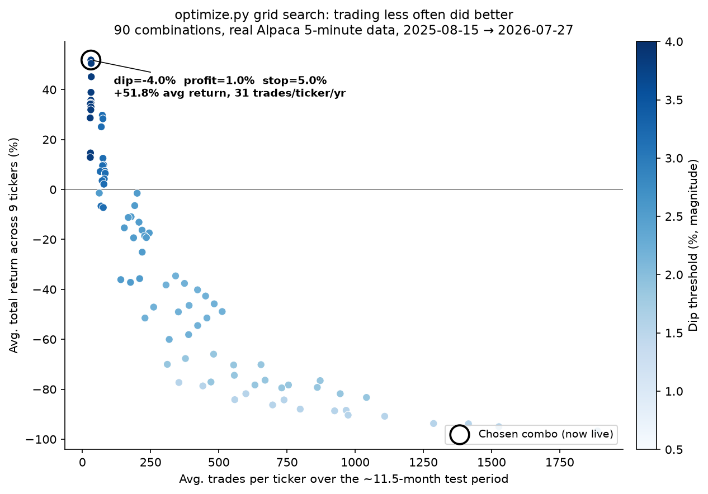
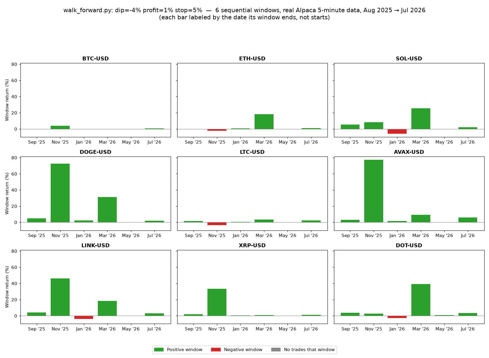
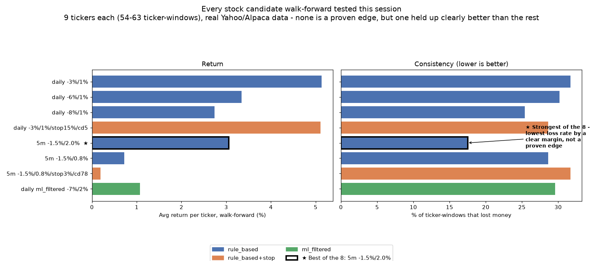
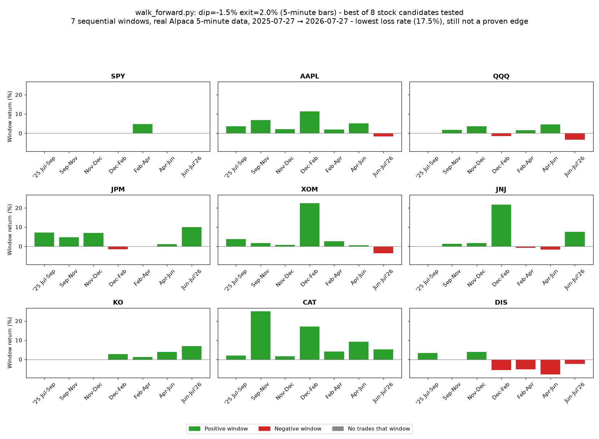
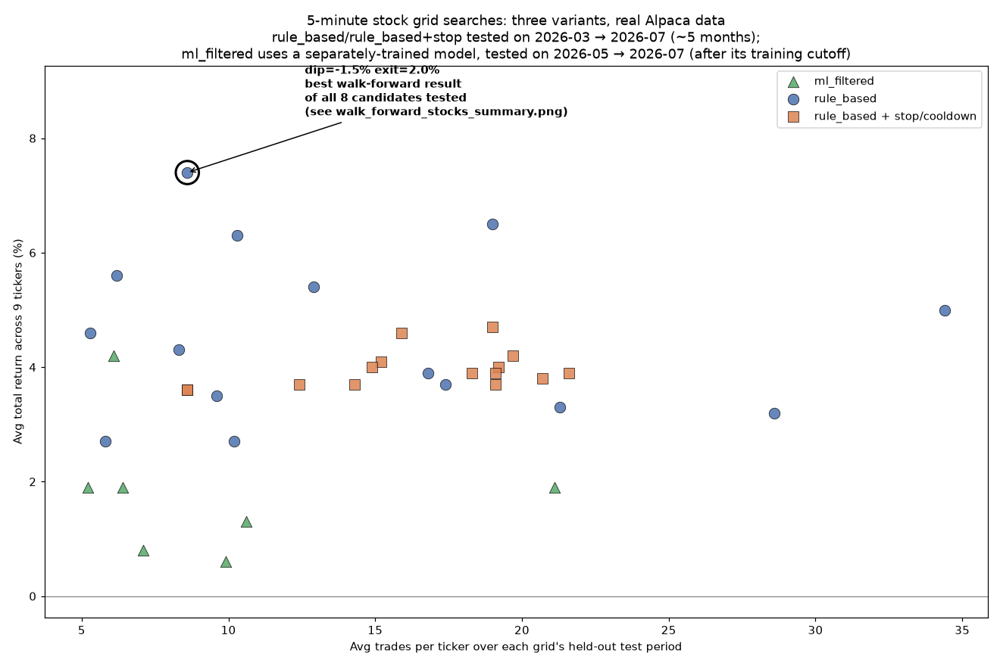

<div align="center">

# InvestingBot — Version Richards 0.26.0

[](https://www.python.org/downloads/)
[](tests/)
[](docs/RISK.md)
[](CHANGELOG.md)

*A systematic "buy the dip" strategy for stocks and crypto — backtested, searched, validated, and paper-traded in the open.*

</div>

Version history lives in `CHANGELOG.md`.

A "buy the dip" stock and crypto strategy: I backtest it, search for better
settings systematically, then optionally run it automatically against a
paper (fake-money) brokerage account.

> [!WARNING]
> **Not investment advice.** I built this to answer a specific question before
> any real money gets involved: do these dip-buying rules actually beat just
> buying and holding? For a long time the honest answer was no. As of
> 2026-07-27, walk-forward validation against a real year of data found a
> configuration that may have found something real - **meaningfully
> de-risked, not yet a proven steady edge** - which is exactly why it's
> running live on the paper account now instead of just sitting in a
> backtest. See "Current live status" below for the full picture, caveats
> included. I'm only going to consider real money once
> something actually demonstrates an edge with real trades, not just
> backtested ones.

## Contents

- [Documentation](#documentation)
- [Current live status](#current-live-status-as-of-this-writing)
- [Dashboard Website](#dashboard-website)
- [Setup](#setup)
- [Architecture](#architecture)
- [Security: who can see what, and who can change what](#security-who-can-see-what-and-who-can-change-what)
- [Disclaimer](#disclaimer)

---

## Documentation

This README covers the overview, current status, installation, and
architecture. Deeper material lives in `docs/`:

- **[docs/BEGINNER_GUIDE.md](docs/BEGINNER_GUIDE.md)** - new to this
  project, or newer to coding in general? A plain-English walkthrough of
  every piece: what a workflow file is, what `--strategy day_trading`-style
  options mean, why this is all in Python, how the automation runs every
  5 minutes without a computer being on, plus a glossary of terms used
  throughout this repo.
- **[docs/AUTOMATION.md](docs/AUTOMATION.md)** - setting up automated
  paper trading: Alpaca account/keys, GitHub Actions, cron-job.org, crypto
  vs. stock specifics, and how logging/the trade dashboard work.
- **[docs/RISK.md](docs/RISK.md)** - the risk controls currently in
  place (circuit breaker, position cap), and what's required before this
  ever touches real money.
- **[docs/RESEARCH.md](docs/RESEARCH.md)** - backtesting, what each
  strategy and the ML model actually do, and the two tools for searching
  and validating parameter choices (`optimize.py`, `walk_forward.py`).
- **[CHANGELOG.md](CHANGELOG.md)** - full version-by-version history.

---

## Current live status (as of this writing)

I keep this section updated so I don't have to reverse engineer what's
actually running from workflow files six months from now. This is a
snapshot and will be stale by the time you read it - check the
[Dashboard Website](#dashboard-website) for the live
number. **This section only covers what's true right now** - every bug,
incident, and past decision that shaped this configuration is in
`CHANGELOG.md`, not repeated here.

**Both crypto and stocks are currently RUNNING** (paper), triggered
**only** by an external scheduler ([cron-job.org](https://cron-job.org))
calling each workflow's `workflow_dispatch` endpoint every 5 minutes.
Both were paused a second time on 2026-07-28 (see `CHANGELOG.md` 0.10.0)
to find and fix the actual root cause of a rolling-average staleness
problem the first pause (0.9.18) had only flagged, not resolved - a
`live_trade.py` bug (a bare calendar date passed as the historical-bars
request's upper bound, silently excluding the entire current trading
session from every stock fetch), not an Alpaca data problem. Verified
live after the fix: a real run's console log showed a decision "as of"
timestamp only ~2.5 minutes old, not frozen on a prior session. A
follow-up bug sweep (0.10.1) found and fixed one regression the fix
itself had introduced (a silently-broken Yahoo-fallback tier for live
stock decisions - never actually triggered in production, since Alpaca
has been healthy throughout, but worth closing before it could matter).
Every open stock position was manually sold and the paper account reset
again ($99,751.68 is the tracking baseline since). Neither workflow has
a GitHub-side `schedule:` trigger either way - GitHub itself never fires
either one on its own; only the external scheduler or a manual "Run
workflow" click can.

Crypto and stocks are otherwise completely independent - different
tickers, different strategy code, different thresholds, separate
on/off switches (each is its own cron-job.org job, so either can be
paused without touching the other). Same fields, side by side, so
neither one is missing information the other has:

| | Crypto | Stocks |
|---|---|---|
| **Running right now?** | Yes | Yes |
| **Triggered by** | cron-job.org only, every 5 min | cron-job.org only, every 5 min |
| **Strategy** | `day_trading` (rule-based, no ML) | `rule_based` (rule-based, no ML) |
| **Tickers** | BTC, ETH, SOL, DOGE, LTC, AVAX, LINK, XRP, DOT | SPY, AAPL, QQQ, JPM, XOM, JNJ, KO, CAT, DIS |
| **Bar size** | 5-minute | 5-minute |
| **Price data source** | Alpaca first (bars, own built-in staleness check), Yahoo only as a last resort | Alpaca first (bars, same `get_price_data_smart()` mechanism `optimize.py`/`walk_forward.py` validate against, plus an explicit staleness check - see `CHANGELOG.md` 0.10.0/0.10.1), Yahoo only as a last resort |
| **Buy signal** | price ≥4.0% below its 20-bar average | price ≥1.5% below its 20-bar average |
| **Sell signal** | +1.0% profit **or** -5.0% stop-loss from entry | back within 2.0% of the average (no stop-loss) |
| **$ per trade** (`--position-fraction`) | 20% of currently available cash | 20% of currently available cash |
| **Max $ per trade** (`--max-notional`, blast-radius cap only) | $30,000 | $30,000 |
| **Daily loss circuit breaker** | 5% of that day's starting balance | 5% of that day's starting balance |
| **Market-hours guard** | N/A - crypto trades 24/7 | Yes - refuses to submit a BUY/SELL unless Alpaca's own market clock confirms the market is open right now |
| **Demonstrated edge?** | No - "meaningfully de-risked," not proven | No - best-of-8 walk-forward candidate, not proven |
| **Current positions/trades** | See the [Dashboard Website](#dashboard-website) | See the [Dashboard Website](#dashboard-website) |

Both share: **real-money mode disabled** (2 independent locks - see
`docs/RISK.md`), **stock model retraining off** (`ml_filtered` isn't
live right now, so there's nothing to retrain for), and **CI running
the test suite on every push/PR** (`.github/workflows/ci.yml`).

**What "143 tests passing" (`pytest tests/`) actually means:** these are
fast, offline checks that specific pieces of code do what they're
supposed to on made-up numbers - e.g. "does the stop-loss actually
trigger when price falls exactly 5% below entry," "does the circuit
breaker actually block a new BUY once the account is down 5% today,"
"does `has_open_order()` actually stop a second order from stacking on
an unfilled one." **They say nothing about whether either strategy
makes money** - that question is only ever answered by the backtests,
grid searches, and walk-forward validation linked below, run against
real market data, never by the test suite. A green test suite means
the code isn't broken; it does not mean the strategy is good.

- **Crypto: rule-based, no ML - buy a 4.0% dip, sell at +1.0% profit or
  -5.0% stop-loss.** Backed by a 90-combo grid search and walk-forward
  validation across a real year of Alpaca data. **Read as meaningfully
  de-risked, not yet a proven steady edge** - a large share of the gain
  sits in two specific calendar windows where several coins moved
  together (more likely a broad market swing than nine independent
  edges). **Real evidence, committed and checkable:**
  [`results/param_sweep/param_sweep.csv`](results/param_sweep/param_sweep.csv) (the grid search)
  and [`results/walk_forward/walk_forward.csv`](results/walk_forward/walk_forward.csv) (its
  per-window validation). Full writeup: `CHANGELOG.md` 0.7.0.

  

  

- **Stocks: `rule_based`, 5-minute bars, dip=-1.5% / exit=2.0% - the
  best of 8 candidates walk-forward tested.** Its loss rate (**17.5%**
  of ticker-windows) is well below every other candidate's (25-32%),
  while its average return (3.06%/ticker) is still solidly mid-pack -
  the only candidate that didn't trade one strength away for the
  other. **Still not a proven edge** - one year of 5-minute data, and
  8.6 average trades per ticker is a real but thin sample. Read it as
  "the strongest lead of what's been tried," not "ready to deploy."
  **Full candidate-by-candidate breakdown, every command used:**
  `docs/RESEARCH.md`.

  

  

  

  

- **Dashboard: a live website, regenerated hourly - `results/trade_dashboard.png`
  is too.** See [Dashboard Website](#dashboard-website)
  below - the same real numbers the PNG panels always showed
  (whole-account net gain/loss, realized P&L and win/loss split by asset
  class, live unrealized P&L, current open positions), now also a
  deployed page with Today/This Week/This Month/All-Time views and its
  own dedicated charts page. `update-dashboard.yml` regenerates both the
  website and `results/trade_dashboard.png` (via `visualize_log.py`)
  every run - neither replaced the other.

**What's next:** no further changes are planned right now. Both
configurations above are "meaningfully de-risked" candidates, not
proven ones - the plan is to let them trade (paper money) and
accumulate enough real closed trades to actually test that, not to tune
further off a handful of days of live data.

---

## Dashboard Website

A clean, professional dashboard wrapped around real numbers: headline
metric cards for account value/P&L/win-rate, position cards for open
positions (colour-coded by unrealized P&L, sectioned by stocks vs.
crypto with a consistent colour language used everywhere on the site),
a trade history table, and a dedicated charts page - organized into
clearly labeled tabs (Overview / Positions / Trades / Charts) so nothing
requires a long scroll to find. A restrained animated backdrop (drifting
particles, faint connecting lines, an occasional ghost market-line) sits
behind everything for atmosphere without ever competing with the real
numbers. Clicking any open position (on either the Positions tab or the
Charts page) opens its real price history since that position was
opened - the same Alpaca-backed historical bars this project already
uses for backtesting, not a separate/fabricated data source. See
`CHANGELOG.md` 0.11.0 for the original build (which replaced
`results/trade_dashboard.png` as the primary view), 0.11.1/0.11.2 for
fixes from real usage, 0.12.0 for the full professional redesign (tabs,
colour scheme, a real bug where a data render error could silently kill
every tab's click handler), 0.14.0 for the animated background/glass-card
visual pass that replaced the site's one earlier playful touch (a panda
intro splash), and 0.16.0 for the per-position price-history charts.

**Website URL:** `https://harringtonethan.github.io/InvestingBot/` once
GitHub Pages is enabled (one-time manual step, see below) - not something
this repo can guarantee is live without that step having been done in
this repository's own Settings.

### Pages

- **`index.html`** - a top nav bar with Overview/Positions/Trades as
  in-page tabs (only one section on screen at a time) plus a Charts link,
  headline metric cards, a Today/This Week/This Month/All Time period
  selector, then the active tab's content. Kept deliberately light: no
  Chart.js, no canvases.
- **`charts.html`** - mirrors `results/trade_dashboard.png`'s own panel
  layout exactly, on request, so the two never look like they're showing
  different things: whole-account net gain/loss, then crypto and stocks
  each get their own cumulative-realized-P&L chart, win/loss-per-ticker
  chart, and a "Current Open Positions" panel, grouped into "Account
  Performance" / "Crypto" / "Stocks" sections. There's no Combined /
  Stocks / Crypto selector (a whole-account value split by asset class
  doesn't exist to plot - see below) and no daily-P&L/drawdown/strategy
  charts (the PNG doesn't have them either). Split onto its own page so
  the main dashboard never has to load Chart.js or render canvases.
  Fully interactive: hover (or tap on mobile) for an exact-value tooltip
  with the ET timestamp, portfolio value, gain/loss, period return and
  change from the previous recorded point; a snapped vertical crosshair;
  clickable legend; a Today / This Week / This Month / All Time range
  control that reads the exact same period boundaries `dashboard.json`
  computes server-side (never a separately-computed rolling window);
  optional drag-to-zoom with a reset button; and a text summary under
  each chart for screen readers. The net gain/loss line, its hover
  point, the card's hover outline, and the summary's headline number are
  all colored green when the period is up and red when it's down - the
  same convention "Max Drawdown" already uses on the main dashboard.

  **What the per-class series actually are:** the stock and crypto
  workflows each log the *whole account's* value, not a separate
  per-asset-class balance, so a historical portfolio value split by
  asset class does not exist in the logs and is not estimated. The
  Stocks/Crypto series show **cumulative realized P&L from confirmed
  sell fills**, which genuinely is per-class and timestamped. A series
  with no sample at a given timestamp shows "No recorded value" - gaps
  are never zero-filled or interpolated.

  **Every period's start is floored at the account's most recent
  relaunch.** `site_data.py`'s `find_account_relaunch()` reads the
  equity log's own `cash_usd`/`portfolio_value_usd` columns for the most
  recent point they're exactly equal - 100% cash, zero open positions,
  the same signature every relaunch leaves behind - and uses it as a
  floor under Today/This Week/This Month/All Time's calendar
  boundaries, so a calendar cutoff earlier than that point (e.g. the
  1st of the month) can never pull pre-relaunch history back in. The
  point it detects is exposed as `account_relaunch` in `dashboard.json`.

### How the live update works

**`update-dashboard.yml`'s trigger and schedule are unchanged** from
before the website existed (still fired by cron-job.org hitting its
`workflow_dispatch` endpoint hourly, still has the same best-effort
native `schedule:` as a fallback). Each run:

1. `site_data.py` reads `logs/*.csv` and, read-only, pulls current
   positions/cash/equity/buying power from Alpaca - writing four JSON
   files into `site/data/`.
2. `visualize_log.py` reads the same logs and regenerates
   `results/trade_dashboard.png`, which gets committed back to the
   branch (same git pull-rebase-push retry pattern the trading workflows
   use for their logs). Safe against workflow loops because this
   workflow is schedule/`workflow_dispatch`-triggered, never
   push-triggered - a commit landing on the branch can't make it fire
   again.
3. The whole `site/` directory (the static `index.html`/`charts.html`/
   `assets/` checked into git, plus this run's freshly-generated
   `data/*.json`) is uploaded as a **GitHub Pages deployment artifact**
   and published. `site/data/*.json` is never committed to the branch -
   it only ever exists inside this one run's deployment artifact.

The website is a **static site with generated JSON data** - there is no
server, no database, and no secrets anywhere in `site/`. The browser
just fetches `data/dashboard.json` etc. directly.

### One-time setup this repo needs (can't be done from a workflow file)

In this repository's **Settings → Pages → Build and deployment**, set
**Source** to **"GitHub Actions"** (not a branch). Until that's set, the
`deploy` job in `update-dashboard.yml` will fail even though `build`
succeeds - that's expected, not a bug, until this one manual toggle is
flipped once.

### Data definitions (what each period actually measures)

- **Starting/Ending value**: the last known account equity at or before
  the period's own calendar start, carried forward - *not* a fixed
  dollar amount. If nothing was logged before that point (e.g. right
  after an account reset), it falls back to the first value logged
  *within* the period, and the page says so explicitly rather than
  presenting it as a true start-of-period balance.
- **All Time**: starts from the very first row ever logged in
  `equity_log_crypto.csv`/`equity_log_stocks.csv` - there is no
  hardcoded baseline anywhere in this pipeline anymore.
- **Today / This Week / This Month**: calendar boundaries in **US
  Eastern Time** (midnight ET for today/month, Monday midnight ET for
  the week) - computed with real IANA timezone rules (`zoneinfo`), so
  DST transitions are handled correctly, not approximated with a fixed
  offset. All timestamps in the underlying data stay UTC; ET only
  enters at the boundary-computation and display-formatting steps.
- **Number of trades / win rate / best / worst trade**: count only
  **confirmed-fill SELL executions** (a completed round trip). A
  submitted-but-unconfirmed order or one that was never placed at all
  (blocked by the circuit breaker, market-hours guard, etc.) is tracked
  separately (`num_buys`/`num_unconfirmed`/`num_not_placed` in
  `dashboard.json`) and never silently counted as a "trade."
- **Realized P&L**: computed only from confirmed fills, for the same
  reason - an unconfirmed order's logged price is a decision-time
  estimate, not a real execution.
- **Order status** (shown on every ledger row): exactly three
  categories - `confirmed_fill`, `submitted_unconfirmed`, `not_placed` -
  see `site_data.py`'s `classify_order_status()` docstring for why this
  project's logging can't honestly support a richer set (e.g.
  "canceled"/"rejected") today.
- **Reset/relaunch caveat**: `trade_log_*.csv` gets archived and
  restarted fresh on a same-day relaunch, but `equity_log_*.csv` never
  resets - so a period's equity-based Dollar P&L can include swings from
  before a relaunch that the trade history no longer covers, making it
  not add up against Realized + Unrealized P&L below it. When
  `site_data.py` detects this (the earliest trade currently on record is
  newer than a period's own starting reference), the dashboard shows an
  explicit ⚠️ banner rather than presenting an unexplained gap.

### Local preview instructions

```bash
# 1. Generate real JSON from whatever's currently in logs/ (add
#    --live-positions if you have ALPACA_API_KEY/ALPACA_SECRET_KEY set
#    and want live positions/cash/equity too - read-only, never trades):
python site_data.py --out-dir site/data

# 2. Serve site/ over plain HTTP - opening index.html directly via
#    file:// will NOT work, browsers block fetch() of local files under
#    file:// for CORS reasons:
python -m http.server 8000 --directory site

# 3. Open http://localhost:8000/index.html (charts are on their own
#    page: http://localhost:8000/charts.html)
```

### Troubleshooting

- **Page loads but says "the house data hasn't loaded yet"**: either
  you skipped step 1 above locally, or (on the deployed site) the
  workflow hasn't successfully run since Pages was enabled yet - check
  the `update-dashboard` workflow's Actions history.
- **Deploy job fails, build job succeeds**: GitHub Pages isn't enabled
  for GitHub Actions deployment yet - see "One-time setup" above.
- **Charts page is blank but the main page renders fine**: Chart.js
  loads from a CDN (`cdn.jsdelivr.net`) on `charts.html` only - an ad
  blocker, offline preview, or a restrictive network can block it. The
  main page (`index.html`) doesn't load Chart.js at all, so it's
  unaffected either way.
- **A number looks stale**: check the "Last updated" line - the site
  only refreshes when `update-dashboard.yml` actually runs (hourly at
  best, entirely dependent on cron-job.org firing it - see
  `docs/AUTOMATION.md` for that scheduler's own reliability notes).
- **Positions/cash/buying power all show "unavailable"**: the workflow's
  `--live-positions` Alpaca call failed that run (bad credentials, rate
  limit, Alpaca outage) - `positions.json`'s `reason` field says why.

---

## Setup

Everything below takes you from a completely fresh machine (nothing
installed) to being able to run every command in this README. Pick
whichever section matches your operating system - both end up in the
exact same place.

**Prerequisites, either way:**
- Python 3.12 or newer
- git
- A free [Alpaca](https://alpaca.markets) account - only needed for
  live paper trading later on, not for the backtesting steps below

### Windows

1. **Install Python.** Download the installer from
   [python.org/downloads](https://www.python.org/downloads/). On the
   first install screen, check **"Add python.exe to PATH"** before
   clicking Install - easy to miss, and without it `python` won't be
   recognized in a terminal.
2. **Install git.** Download from
   [git-scm.com/download/win](https://git-scm.com/download/win) and run
   the installer, default options are fine.
3. **Open a terminal.** PowerShell works (search "PowerShell" in the
   Start menu).
4. **Clone the repository:**
   ```powershell
   git clone https://github.com/HarringtonEthan/InvestingBot.git
   cd InvestingBot
   ```
5. **Create and activate a virtual environment** - keeps this project's
   Python packages separate from anything else on your machine:
   ```powershell
   python -m venv venv
   venv\Scripts\activate
   ```
   The prompt should now start with `(venv)` - that confirms it worked.
6. **Install dependencies:**
   ```powershell
   pip install -r requirements.txt
   ```
7. **Verify it works:**
   ```powershell
   python main.py --ticker SPY --start 2015-01-01 --split 2022-01-01 --end 2024-12-31
   ```
   This should print a strategy comparison table and save a chart to
   `results/equity_curve.png`.

### macOS

1. **Install Python.** macOS ships with an old system Python that
   shouldn't be used for this - install a current version instead.
   Easiest path is [Homebrew](https://brew.sh):
   ```bash
   /bin/bash -c "$(curl -fsSL https://raw.githubusercontent.com/Homebrew/install/HEAD/install.sh)"
   brew install python@3.12
   ```
   Or download the installer directly from
   [python.org/downloads](https://www.python.org/downloads/).
2. **Install git.** Usually already present - check with
   `git --version` in Terminal. If it's missing, macOS will prompt to
   install the Xcode Command Line Tools, or install it via Homebrew:
   `brew install git`.
3. **Open Terminal** (Applications -> Utilities -> Terminal, or
   Spotlight search "Terminal").
4. **Clone the repository:**
   ```bash
   git clone https://github.com/HarringtonEthan/InvestingBot.git
   cd InvestingBot
   ```
5. **Create and activate a virtual environment:**
   ```bash
   python3 -m venv venv
   source venv/bin/activate
   ```
   The prompt should now start with `(venv)` - that confirms it worked.
6. **Install dependencies:**
   ```bash
   pip install -r requirements.txt
   ```
7. **Verify it works:**
   ```bash
   python main.py --ticker SPY --start 2015-01-01 --split 2022-01-01 --end 2024-12-31
   ```
   This should print a strategy comparison table and save a chart to
   `results/equity_curve.png`.

Once setup is done, see `docs/AUTOMATION.md` to connect a real (paper)
Alpaca account and run this on a schedule, or `docs/RESEARCH.md` to run
and interpret a backtest first.

---

## Architecture

```
InvestingBot/
├── .env.example                  # Template for local Alpaca credentials - copy to .env, never commit .env itself
├── requirements.txt              # Pinned third-party Python dependencies
├── main.py                       # Backtest entry point (research only, no real broker involved)
├── optimize.py                   # Multi-ticker parameter sweep for the day-trading strategy
├── walk_forward.py               # Validates a parameter combo across multiple time periods, not just one
├── train_stock_model.py          # Trains and saves the stock ML dip-filter model
├── live_trade.py                 # Automated live (paper) trading entry point
├── site_data.py                  # Reads logs/*.csv (+ optional live Alpaca query) -> site/data/*.json for the website
├── visualize_log.py              # Builds results/trade_dashboard.png - still run by update-dashboard.yml alongside the website
├── site/                         # The dashboard website (GitHub Pages) - see README's own section on it
│   ├── index.html                 #   nav, metrics, tabs (Overview/Positions/Trades) - now loads Chart.js too, for position-chart.js
│   ├── charts.html                #   every graph, its own page, own Today/Week/Month dropdown
│   ├── assets/
│   │   ├── styles.css             #   real dashboard theme/layout
│   │   ├── dashboard.js           #   real-data rendering for index.html (metrics, positions, trade history)
│   │   ├── charts.js              #   real-data rendering for charts.html (all Chart.js charts)
│   │   ├── position-chart.js     #   shared "price since purchase" modal - loaded by both pages
│   │   └── background.js         #   purely decorative animated backdrop - never reads any of the JSON below
│   └── data/                      # Generated by site_data.py, gitignored - never committed (see update-dashboard.yml)
├── src/
│   ├── data.py                   # Price data loading (Yahoo Finance + synthetic fallback; Alpaca-first for crypto validation)
│   ├── alpaca_data.py            # Live crypto price data (Alpaca, used instead of Yahoo)
│   ├── features.py               # Technical indicators (SMA, RSI, volatility, drawdown)
│   ├── strategies.py             # The five trading strategies
│   ├── model.py                  # ML dip-filter: training and label logic
│   ├── model_store.py            # Save/load a trained model to disk
│   ├── backtest.py               # Backtest engine: turns a position series into results
│   ├── broker.py                 # Alpaca account/order wrapper
│   └── symbols.py                # Resolves a ticker into Yahoo/Alpaca symbol formats
├── .github/workflows/
│   ├── paper-trade-crypto.yml    # Runs live_trade.py for crypto every ~5min (workflow_dispatch only - no GitHub-side schedule)
│   ├── paper-trade-stocks.yml    # Runs live_trade.py for stocks every ~5min in market hours (workflow_dispatch only - no GitHub-side schedule)
│   ├── retrain-stock-model.yml   # Runs train_stock_model.py weekly
│   └── update-dashboard.yml      # Runs site_data.py + deploys site/ to GitHub Pages hourly
├── tests/                        # pytest suite - run with `pytest tests/`
├── docs/                         # Beginner guide, automation setup, risk controls, research tools
├── logs/                         # Generated: trade_log_{crypto,stocks}.csv, equity_log_{crypto,stocks}.csv, retrain_log.csv
├── models/                       # Generated: the saved stock_model.pkl and its metadata
├── results/                      # Generated: trade_dashboard.png (archived/frozen - see site/ for the live one), equity_curve.png
│   ├── param_sweep/               #   all optimize.py grid-search output (CSVs + scatter charts)
│   └── walk_forward/              #   all walk_forward.py validation output (CSVs + candidate charts)
├── CHANGELOG.md                  # Full version history
└── README.md                     # This file
```

**Two separate pipelines share code:**
- **Backtesting (research, no real money, no live prices):**
  `main.py` / `optimize.py` / `walk_forward.py` → `src/data.py` (fetch
  *historical* data) → `src/features.py` (compute indicators like
  RSI/SMA) → `src/strategies.py` (simulate what a strategy *would have*
  done) → `src/backtest.py` (score it: return, Sharpe, drawdown). Nothing
  here ever touches a real broker.
- **Live trading (paper money, real live prices, right now):**
  `live_trade.py` → `src/alpaca_data.py` or `src/data.py` (fetch
  *current* data) → `src/features.py` (same indicator code) →
  `src/strategies.py` or `src/model.py` (make today's actual decision)
  → `src/broker.py` (place the real - paper - order via Alpaca) →
  `logs/*.csv` (record what happened).

Both pipelines reuse the same feature/strategy code on purpose - it's
the only way to trust that a backtest result says anything about what the
live version will actually do; if they used separate logic, a good
backtest wouldn't mean anything about live behavior.

See `docs/RESEARCH.md` for what each strategy and the ML model actually
do, and `docs/AUTOMATION.md` for the live-trading, logging, and dashboard
files.

---

## Security: who can see what, and who can change what

A public GitHub repository means the source code is visible to anyone -
every strategy, every threshold, every workflow file. That doesn't mean
credentials are exposed; a few separate mechanisms decide what actually
is and isn't visible or changeable:

- **API keys and secrets are never in the code, and aren't visible to
  anyone once saved.** They belong in **GitHub Actions secrets**
  (Settings -> Secrets and variables -> Actions), a separate, encrypted
  vault from the repository itself. A secret's value can never be viewed
  again after saving - not by other people, not by me, only *used* by a
  workflow at runtime. If a workflow's console output ever tried to
  print one, GitHub automatically detects and masks it as `***` before
  the log is shown, public repo or not. This is why `ALPACA_API_KEY` /
  `ALPACA_SECRET_KEY` live there rather than in `.env` (which is
  git-ignored precisely so it's never committed by accident either).
- **Tokens used by an external scheduler (e.g. cron-job.org) live
  entirely outside this repository** - in that service's own account
  configuration, invisible to anyone browsing GitHub. Such a token is
  still a real, live credential: anyone who obtained it could trigger
  the linked workflows on demand. Scoping it as narrowly as possible -
  e.g. "Actions: read and write" on only this one repository, nothing
  else - limits the damage a leaked token could do to spam-triggering
  workflow runs, not pushing code or reaching a broker account directly.
- **Only explicitly added collaborators can push or edit code.** Check
  Settings -> Collaborators and teams on GitHub to see exactly who
  currently has write access - by default, that's just me, the
  repository owner. Being public means anyone can fork the repo and open
  a pull request proposing a change, but a pull request is only a
  proposal sitting in a queue: nothing merges into the repository unless
  someone with write access reviews and approves it.
- **Making a repository private** (Settings -> General -> Danger Zone ->
  Change visibility) hides the source code from public view entirely.
  It's purely a visibility toggle - it doesn't touch secrets or
  workflows, and the automation described throughout this project keeps
  working identically either way.

---

## Disclaimer

> [!NOTE]
> This project is for education and research. Nothing here is financial
> advice, and past backtest performance - synthetic or real - doesn't
> predict future results. I built this to learn, not to manage anyone's
> money, including my own, until it earns that.
