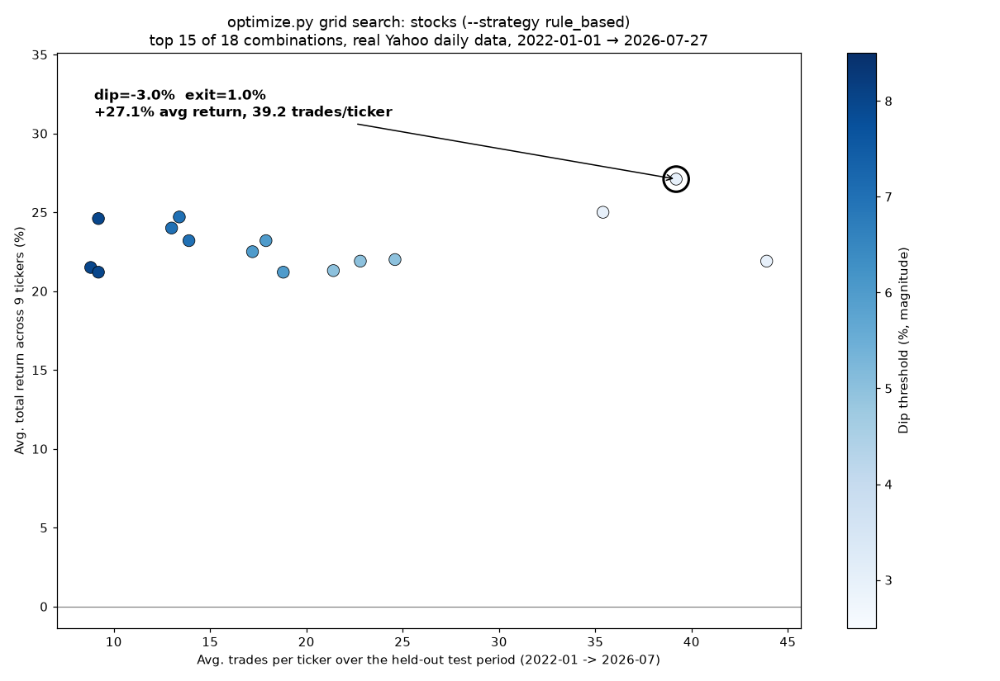
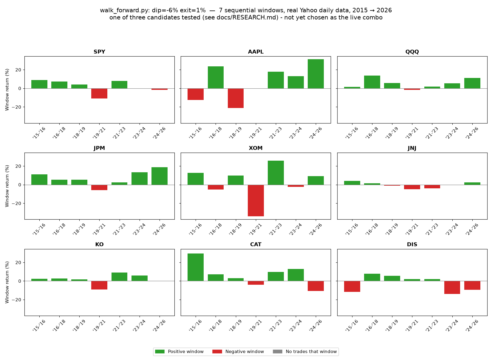

# Research: backtesting, strategies, optimization, and validation

[← Back to README](../README.md)

This covers the research/backtesting side of the project - what each
strategy and the ML model actually do, how to run a backtest, and the
two tools for searching and validating parameter choices before trusting
them. For what's actually running live right now, see "Current live
status" in the main README; for automation/scheduling setup, see
`docs/AUTOMATION.md`.

## Running a backtest

Assumes "Setup" in the main README is already done (dependencies
installed, virtual environment activated):

```bash
python main.py --ticker SPY --start 2015-01-01 --split 2022-01-01 --end 2024-12-31
```

`--split` is the train/test cutoff: everything before it is used only to
fit the ML filter, everything after is the held-out test period the
strategies get compared on. On a machine with normal internet access this
pulls real Yahoo Finance data automatically - nothing to change.

### Results (synthetic-data demo run)

In a sandboxed environment without outbound access to Yahoo Finance, the
pipeline falls back to synthetic data automatically (called out loudly
in the console output and chart title) - the numbers below are from that
fallback and **don't tell you anything about real markets**, just that
the pipeline runs correctly end to end:

| Strategy | Total Return | Ann. Return | Ann. Vol | Sharpe | Max DD | Trades |
|---|---|---|---|---|---|---|
| Buy & Hold | -10.2% | -3.4% | 24.3% | -0.02 | -55.7% | 1 |
| Rule-based dip buy | -16.7% | -5.7% | 15.1% | -0.31 | -38.3% | 30 |
| ML-filtered dip buy | -22.1% | -7.7% | 13.4% | -0.53 | -31.9% | 16 |

In an earlier exploratory run against a different synthetic sample (a
milder, uptrending 2023-2024-style period), buy-and-hold came out ahead of
both dip-buying variants, and the ML filter underperformed the plain
rule-based version out of sample. That's a genuinely useful, if humbling,
result and worth reporting rather than tuning away: an ML filter losing
to a simpler rule on unseen data is one of the most common outcomes in
quantitative trading, and exactly the "fits noise, not a real edge"
failure mode worth expecting going in. The mechanics (proper time-based
train/test split, no lookahead, transaction costs modeled) are sound -
this particular rule on this particular data simply isn't a demonstrated
edge yet.

## What each piece of `src/` actually does

- `src/data.py` - loads price data at daily or intraday resolution
  (`--interval 1d`, `1h`, `15m`, etc.). Tries Yahoo Finance (`yfinance`)
  first; if there's no network access it falls back to a synthetic price
  series calibrated to realistic market behavior (~9% annual drift, ~19%
  annual volatility, clustered vol regimes), generated at whatever bar
  frequency was requested. Every place synthetic data gets used, it's
  labeled loudly - in the console output and in the chart title - so it
  never gets mistaken for a real result.
- `src/features.py` - technical indicators (SMA, RSI, rolling
  volatility, drawdown-from-high) used both to define a "dip" and as ML
  features. Windows are defined in bars, not calendar days, so a
  "20-period" moving average means whatever 20 *bars* of the requested
  `--interval` spans - a 20-day trend on daily data, a 20-hour trend on
  hourly data, or (the live crypto case) a rolling 100-minute window on
  5-minute bars: 20 x 5 minutes, continuously updated as each new bar
  arrives and the oldest one drops off, not anchored to any fixed clock
  time.
- `src/strategies.py` - five strategies:
  1. **Buy & hold**
  2. **Rule-based dip buy** - buy when price is below its 20-period
     moving average by at least `--dip-threshold` (defaults to 2%), sell
     once it recovers back above the average (mean-reversion exit,
     independent of what was paid). On real recent crypto/5-minute data,
     even a 2% threshold rarely fires - that timeframe's typical moves
     are well under 1%, so this strategy is a better fit for daily bars
     than 5-minute ones.
  3. **ML-filtered dip buy** - same rule and same `--dip-threshold`, but
     only acts on a dip if a model trained to predict "will this bounce?"
     is confident enough.
  4. **Day trading (profit target)** - buy a dip, but sell based on the
     *actual entry price* instead of the moving average: exits once
     price is a set % above entry (a real profit), or cuts losses if
     price falls a set % below entry first (a stop-loss, so it doesn't
     ride a sustained downtrend forever waiting for a recovery that may
     not come). This is the one wired up for the frequent, always-on
     crypto automation - see `docs/AUTOMATION.md`.
  5. **Bollinger breakout** - a trend-following (not mean-reversion) bet:
     buy when price breaks above its upper Bollinger Band while also
     above a long-term trend average, sell when it falls back below the
     middle band. Implemented but not wired into any live workflow -
     backtested on 5-minute crypto bars during a choppy (non-trending)
     stretch, it performed far worse than the other strategies, which is
     expected: it's a trend-following design meant for slower timeframes
     and genuinely trending markets, not what it was tested against.
- `src/model.py` - trains a `RandomForestClassifier` on the training
  period only, with a label of "price rises >=3% within the next 10
  trading days." The confidence threshold used at test time is calibrated
  from the *training* score distribution (75th percentile of training
  scores), not hand-picked to make the test result look good.

  **Machine learning: what it actually does (and doesn't).** This is the
  only ML in the project, and only used by `ml_filtered` - `rule_based`,
  `day_trading` (the live crypto strategy), and `bollinger_breakout` are
  pure rules, no model involved. Important to be clear-eyed about:
  - By default (in a backtest, or via `main.py`) it doesn't "learn" in
    an ongoing/online sense: `train_model()` fits a brand-new
    `RandomForestClassifier` from scratch on whatever training window is
    given to it, uses it once, and discards it.
  - The **live stock workflow is the one exception**: it uses
    `train_model_multi()` + `src/model_store.py` to save a model to
    `models/stock_model.pkl` on a schedule (`train_stock_model.py`, see
    `docs/AUTOMATION.md`) and `live_trade.py` loads that saved model
    instead of retraining inline. That's real persistence between
    runs - but it's still periodic batch retraining (e.g. weekly), not
    the model updating itself after every trade the way "a bot that
    learns" often implies.
  - It's never been shown to beat the plain rule-based version. In the
    one direct real-data comparison run so far, the ML filter
    underperformed the plain rule-based strategy out of sample - a
    common and expected outcome (a filter can easily fit noise in the
    training window rather than a real pattern). Running live
    `ml_filtered` on stocks is a bet that periodic retraining on pooled
    multi-ticker data behaves differently - not yet proven, since that
    setup has no real-data track record yet.
  - Its dip threshold (`--dip-threshold`, controllable like the other
    strategies) still needs to be sized for the timeframe it runs on: a
    threshold that makes sense on daily bars would rarely fire on
    5-minute crypto data, where typical moves are much smaller - one
    more reason ML is kept off crypto and put on stocks instead.
- `src/backtest.py` - a simple long/cash backtest engine: one day of
  execution lag (no lookahead), transaction costs on every position
  change, and standard metrics (annualized return/vol, Sharpe, max
  drawdown, trade count).
- `src/model_store.py` / `train_stock_model.py` - saves/loads a trained
  model to/from `models/stock_model.pkl` so it can be trained once,
  periodically, and reused across live runs instead of being refit from
  scratch every time. See "Machine learning" above and
  `.github/workflows/retrain-stock-model.yml`.
- `main.py` - runs the whole pipeline end to end and saves a comparison
  chart to `results/equity_curve.png`.

## Searching for better thresholds (optimize.py)

Hand-picking a dip/profit/stop combination and hoping it's good is a form
of overfitting if you just keep nudging numbers until one backtest looks
positive. `optimize.py` instead sweeps a whole grid of combinations
across multiple tickers at once and reports the **average** across all of
them - a setting that only works on one coin isn't a real edge, it's
luck:

```bash
python optimize.py --ticker BTC-USD ETH-USD SOL-USD DOGE-USD LTC-USD AVAX-USD LINK-USD XRP-USD DOT-USD \
  --interval 5m --start 2026-05-27 --split 2026-07-11 --end 2026-07-25 --cost-bps 20 \
  --dip-values=-0.003,-0.005,-0.008,-0.01,-0.015,-0.02 \
  --profit-values 0.005,0.008,0.01,0.015,0.02 \
  --stop-values 0.01,0.015,0.02,0.03
```
(Note the `=` in `--dip-values=...` - without it, argparse mistakes the
leading `-` for a new flag.)

It prints the top combinations by average return and writes the full
grid to `results/param_sweep.csv`. **Before trusting whatever comes out
on top:** open that CSV and check whether nearby parameter values also
perform reasonably well (a real signal) or whether the winner is an
isolated spike surrounded by much worse neighbors (almost always noise
from testing many combinations - exactly the "parameter sensitivity
check" step that separates a real strategy from an overfit one). Even a
robust-looking winner still needs to be re-validated on a later,
different time window before trusting it with anything beyond fake
money - finding good settings on one stretch of history is the easy
part; knowing they'll hold up going forward is the part that actually
matters. That's exactly what `walk_forward.py` below is for.

Crypto tickers here pull historical bars from Alpaca first, not just
Yahoo Finance (`get_price_data_smart()`, same data path `walk_forward.py`
below uses) - so this grid search can run over a genuine year or more of
real 5-minute data, not the ~60 days Yahoo alone allows. Each ticker's
line during data loading shows which source served it (`alpaca`/`yahoo`).

**A concrete reason to re-run this:** a `walk_forward.py` run against a
full year of real Alpaca data found the live -1%/+1%/-3% combo losing
money in the overwhelming majority of windows across nearly every
coin, often trading 100-300+ times in a single ~2-month window at
`--cost-bps 20` - meaning transaction costs alone (roughly trades × 0.2%)
could plausibly account for a large share of the losses seen. That
points toward searching for combos that trade less often (wider
`--dip-values`, larger `--profit-values` relative to the real ~0.2-0.4%
round-trip fee floor) rather than more often:

```bash
python optimize.py --ticker BTC-USD ETH-USD SOL-USD DOGE-USD LTC-USD AVAX-USD LINK-USD XRP-USD DOT-USD \
  --interval 5m --start 2025-08-01 --split 2025-08-15 --end 2026-07-27 --cost-bps 20 \
  --dip-values=-0.005,-0.01,-0.015,-0.02,-0.03,-0.04 \
  --profit-values 0.01,0.015,0.02,0.03,0.04 \
  --stop-values 0.02,0.03,0.05
```

### Validating the stock side (`--strategy rule_based`)

Both `optimize.py` and `walk_forward.py` default to `--strategy
day_trading` (crypto's dip/profit-target/stop-loss shape), but also
support `--strategy rule_based` - the mean-reversion dip/recovery-exit
rule `ml_filtered` (the live stock strategy) sits on top of. It's a
different parameter shape (`--dip-values`/`--exit-values`, no
profit-target or stop-loss - see `position_for_params()` in
`src/strategies.py`, the one place both scripts get this dispatch from,
so they can't quietly drift apart on it). The live stock workflow's
`--dip-threshold -0.03` was never actually validated this way - it was
just picked:

```bash
python optimize.py --ticker SPY AAPL QQQ JPM XOM JNJ KO CAT DIS --strategy rule_based --interval 1d \
  --start 2015-01-01 --split 2022-01-01 --end 2024-12-31 --cost-bps 5 \
  --dip-values=-0.01,-0.02,-0.03,-0.04,-0.05 \
  --exit-values 0.0,0.01,0.02
```
(`--interval 1d` matters here - `optimize.py`'s own default is `5m`,
crypto's interval; leaving it off for a 2015-2024 stock range hits the
exact same Yahoo 60-day intraday cap crypto ran into, just for the
wrong reason.)

Nine tickers, spanning several sectors on purpose (broad market, tech,
financials, energy, healthcare, staples, industrials, media) - the same
"a setting that only works on one coin isn't a real edge" principle from
crypto, applied here specifically to avoid the correlation problem that
same walk-forward evidence ran into (several coins moving together in
the same market swing, inflating how independent the result actually
was).

No Alpaca work needed here - stocks run on daily bars, and Yahoo's daily
history already goes back decades for all of these, unlike crypto's
5-minute intraday cap. `--cost-bps 5` (not crypto's 20) matches stock
commission-free trading's much lower real cost. Take whatever combo
comes out on top through the same neighbor-robustness check as above,
then validate it with `walk_forward.py --strategy rule_based
--dip-threshold ... --exit-threshold ...` before ever changing the live
stock workflow's `--dip-threshold` value.

## Validating across time (walk_forward.py)

`optimize.py` above still only scores each combination against one
held-out test period - even a "robust-looking" winner there could just be
a combination that happened to suit that one stretch of history.
`walk_forward.py` addresses that directly: it splits a date range into
several sequential, non-overlapping windows and re-evaluates the same
fixed parameters independently on each one, so "does this actually hold
up over time" has a real answer instead of a guess:

```bash
python walk_forward.py --ticker BTC-USD ETH-USD SOL-USD --start 2026-06-01 --end 2026-07-25 --windows 4 --interval 5m
```

Run with no flags beyond `--ticker`/`--start`/`--end`/`--windows`, it
defaults to `--strategy day_trading` with whatever the live crypto
workflow currently trades with (see "Current live status" in the main
README for the exact numbers - they've changed once already, see
`CHANGELOG.md` 0.7.0), so this validates the strategy actually running,
not a hypothetical one. Pass `--strategy rule_based --dip-threshold ...
--exit-threshold ...` to validate a stock candidate from `optimize.py`
above instead - see "Validating the stock side" there for the parameter
shape difference. It reports each window's
return/Sharpe/drawdown/trade count individually (plus which data source
that window actually came from - see below), then flags how many windows
were net losers and how many never traded at all (an untested window, not
a proven-safe one) - a combo worth trusting should look reasonable across
most windows, not just win on average because one window carried the rest.

**Data source:** Yahoo Finance only keeps a limited window of intraday
history (roughly 60 days for 5-minute bars), which used to cap any real
5-minute walk-forward test at a couple of months. This tool now tries
**Alpaca's historical bars first** for an intraday interval
(`src/data.py`'s `get_price_data_smart()`) - crypto bars via
`get_crypto_bars_range()`, stock bars via `get_stock_bars_range()` (free
IEX feed, since the full-market SIP feed needs a paid subscription this
project doesn't have) - since Alpaca isn't subject to Yahoo's free-tier
intraday retention limit, so a much longer `--start` (a year or more
back) can work for an intraday interval on either asset class. It needs
`ALPACA_API_KEY`/`ALPACA_SECRET_KEY` in your `.env` (see
`docs/AUTOMATION.md`) even though this never places an order - only
reads market data. Each window's output line ends with which source
actually served it (`alpaca`, `yahoo`, or a `SKIPPED` line if neither
had enough real data): if a window shows `yahoo` or gets skipped instead
of `alpaca`, that's worth noticing - it means Alpaca didn't have data
that far back for that ticker/range and it fell back. A daily-bar
request (`--interval 1d`) always goes straight to Yahoo for stocks -
Yahoo's daily history is already decades deep, so there's no cap to route
around there, and Alpaca's IEX feed is one exchange's view rather than
the consolidated tape Yahoo's daily data reflects.

Every run also writes its full per-window results to `--out` (default
`results/walk_forward.csv`), one row per ticker per window including
skipped ones - a durable, committable record instead of console output
that scrolls away, the same way `optimize.py`'s grid gets saved to
`results/param_sweep.csv`.

**A worked example is committed in this repo**: the live crypto
thresholds changed on 2026-07-27 from -1%/+1%/-3% to -4%/+1%/-5%, and the
evidence behind that change is exactly these two files -
[`results/param_sweep.csv`](../results/param_sweep.csv) (the grid search
that found the new combo) and
[`results/walk_forward.csv`](../results/walk_forward.csv) (its per-window
validation across a real year of Alpaca data). See `CHANGELOG.md` 0.7.0
for the full reasoning, including the caveats (the gain is concentrated
in two specific windows, not spread evenly) that keep this "meaningfully
de-risked" rather than "a proven edge." Rendered versions of both, for a
quicker read than the raw CSVs:


Both were generated straight from the committed CSVs above, not
hand-edited - re-run `optimize.py`/`walk_forward.py` and regenerate them
anytime to check a new result the same way.

**The same exercise for stocks, run 2026-07-27 - no combo chosen yet.**
A grid search (`optimize.py --strategy rule_based`, 9 tickers, 2022-01-01
to 2026-07-27 held out, `--cost-bps 5`) ranked 18 dip/exit combinations;
the top 15 are committed at
[`results/param_sweep_stocks.csv`](../results/param_sweep_stocks.csv)
(the other 3, all `dip=-4%`, scored lowest and weren't printed to the
console this run captured). Three candidates from that grid were then
walk-forward validated across the same 9 tickers and 7 sequential windows
spanning 2015-01-01 to 2026-07-27, committed at
[`results/walk_forward_stocks.csv`](../results/walk_forward_stocks.csv):

| Candidate | Avg return/ticker (walk-forward) | Losing ticker-windows | What it actually shows |
|---|---|---|---|
| dip=-3% exit=1% | highest single-period return (27.1%) | 20 of 63 (32%) | Trades often enough to test every window, but genuinely inconsistent - DIS averaged -5.9% (5 of 7 windows losing), AAPL barely positive (0.8%, 4 losses). |
| dip=-6% exit=1% | middle of the three | 19 of 63 (30%) | About as inconsistent as -3%/1%, just with different winners and losers per ticker (JNJ and DIS both averaged a net negative return across their 7 windows). |
| dip=-8% exit=1% | safest-looking on paper | 16 of 63 (25%) | Trades so rarely that "safe" mostly means "untested," not proven - KO traded in only 1 of 7 windows in 11 years, JNJ in 3 of 7. |

Unlike crypto, where one combo clearly beat the old one and got deployed,
none of these three is a clean winner - the highest-return combo isn't
consistent, and the most-consistent-looking one barely traded enough to
judge. Stocks stay paused (see "Current live status" in the main README)
until a combo actually clears that bar, or until finer-grained data gives
the strategy enough real trades to judge fairly - see the next paragraph.

**Why 5-minute stock bars are the planned next step.** The daily-bar
search above under-trades several tickers so badly that "0 losing
windows" and "1 losing window" are barely distinguishable from noise
(KO's -8%/1% row above is one single trade). `get_stock_bars_range()`
(`src/alpaca_data.py`, added alongside this table) lets
`get_price_data_smart()` pull intraday stock bars from Alpaca's free IEX
feed the same way it already does for crypto, so a
`walk_forward.py --strategy rule_based --interval 5m` run - not yet done,
since it needs real `ALPACA_API_KEY`/`ALPACA_SECRET_KEY` credentials this
environment doesn't have - could give KO and JNJ enough real trades across
the same calendar range to judge the strategy fairly, instead of drawing
"proven safe" conclusions from a single trade.

Rendered charts, generated straight from the two CSVs above:





The bar chart shows the `-6%/1%` candidate specifically - not because it
won, but because it was the most recently tested. Swap in `dip_threshold`/
`exit_threshold` from the CSV and regenerate to see either of the other
two the same way.
